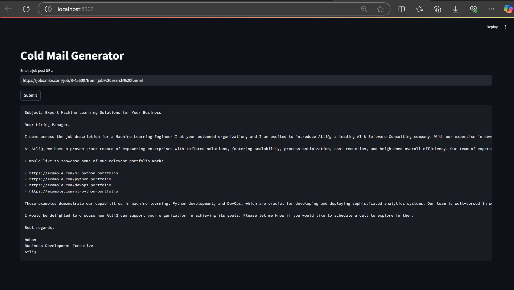

# Cold Email Generator using LangChain and Google Generative AI

## Overview
An AI-powered Cold Email Generator that automates the creation of personalized cold emails using LangChain and Google Generative AI. The app extracts job descriptions from web pages, processes them, and generates customized emails based on user input.

## Features
- **Personalized Email Generation**: Automatically generates cold emails tailored to job descriptions.
- **Web Interface**: Built with Streamlit for easy user interaction.
- **Job Description Extraction**: Extracts and processes job postings from the web.
- **Advanced AI Integration**: Uses LangChain to automate tasks and integrates Google Generative AI for high-quality content generation.
- **Secure API Management**: Utilizes dotenv for managing sensitive environment variables (like API keys).

## Technologies Used
- **Python**: Core programming language.
- **Streamlit**: Framework for building the web interface.
- **LangChain**: Used for task chaining and integrating Google Generative AI.
- **Google Generative AI**: To generate personalized email content.
- **ChromaDB**: For storing and querying portfolio data.
- **Pandas**: For data processing and manipulation.
- **dotenv**: For managing environment variables securely.

## Setup Instructions

### 1. Clone the Repository
Clone the repository to your local machine using:

```bash
git clone https://github.com/priyanka-darshanam/Cold-Email-Generator.git
```
### 2. Install Dependencies
Navigate to the project directory and install the required dependencies:

```bash
cd Cold-Email-Generator
pip install -r requirements.txt
```
### 3. Set Up Environment Variables
Create a .env file in the root directory and add your API keys:
```makefile
GOOGLE_API_KEY=your_google_api_key
```

### 4. Run the Application
Start the app locally by running:
```bash
streamlit run main.py
```
Your application will be available on http://localhost:8501.

## Output Image



## How It Works
1. Users input job descriptions or URLs.
2. The application extracts job details and generates a personalized cold email based on the input.
3. The email is displayed in the user interface for further customization or sending.

## Contact
- Name: Priyanka Darshanam
- Email: priyankadarshanam2000@gmail.com
